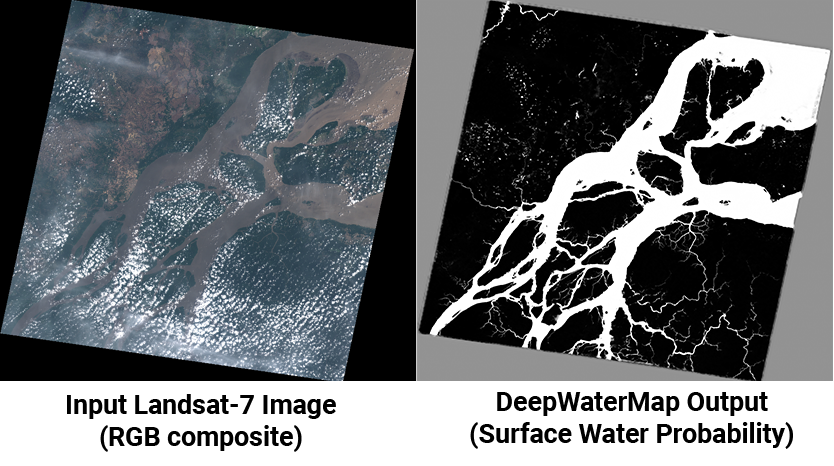

# DeepWaterMap
DeepWaterMap is a deep convolutional neural network trained to segment surface water on multispectral imagery. This repository contains the resources for the most recent version of DeepWaterMap (v2.0).



## Papers
If you find our code, models, or dataset useful in your research, please cite our papers:

* L. F. Isikdogan, A.C. Bovik, and P. Passalacqua, "Seeing Through the Clouds with DeepWaterMap," *IEEE Geoscience and Remote Sensing Letters*, 2019. [[**Read at IEEExplore**]](https://ieeexplore.ieee.org/document/8913594), [[**PDF**]](http://www.isikdogan.com/files/isikdogan2019_deepwatermap_v2.pdf)
* F. Isikdogan, A.C. Bovik, and P. Passalacqua, "Surface Water Mapping by Deep Learning," *IEEE Journal of Selected Topics in Applied Earth Observations and Remote Sensing*, 2017. [[**Read at IEEExplore**]](https://ieeexplore.ieee.org/document/8013683/), [[**PDF**]](http://www.isikdogan.com/files/isikdogan2017_deepwatermap.pdf)

## Dependencies
* TensorFlow (tested on TensorFlow 1.12)
* Numpy
* Tifffile (for reading geotiff files)
* OpenCV (for reading and writing images)

Dependencies can be installed using the Python Package Installer (pip):

```
pip install tensorflow==1.12.0 tifffile opencv-python
```

## Running inference

You can use our inference script to generate a surface water map given a multi-spectral image as:
```
$ python inference.py --checkpoint_path checkpoints/cp.135.ckpt \
    --image_path sample_data/sentinel2_example.tif --save_path water_map.png
```

You can download the checkpoint that contains our trained model parameters at:
[checkpoints.zip](https://utexas.app.box.com/s/j9ymvdkaq36tk04be680mbmlaju08zkq/file/565662752887).

You can find sample input images at: [sample_data.zip](https://utexas.app.box.com/s/j9ymvdkaq36tk04be680mbmlaju08zkq/file/565677626152).

If you receive an out of memory error, try running it on CPU or on a smaller input image. Running inference on a full-sized Landsat image on CPU may take a few minutes.

DeepWaterMap does not require the input images to be Landsat-7, Landsat-8, or Sentinel-2 images. However, it expects the input bands to approximately match the Landsat bands listed below.

```
B2: Blue
B3: Green
B4: Red
B5: Near Infrared (NIR)
B6: Shortwave Infrared 1 (SWIR1)
B7: Shortwave Infrared 2 (SWIR2)
```

See [https://www.usgs.gov/faqs/what-are-band-designations-landsat-satellites](https://www.usgs.gov/faqs/what-are-band-designations-landsat-satellites) for more information about those bands.

If you are using images acquired by a sensor other than Landsat, try to match the bands above as closely as possible and make sure the input bands are in the correct order. The model is robust against the shifts in the spectral responses of sensors. Therefore, the bands do not need to match perfectly.

The inference script we provide gets its input from a 6-band TIFF file. You can modify the script to feed the model a matrix of MxNx6 dimensions in any form. For example, you can read the input bands from separate files, concatenate them in the channel axis, and feed it to the model.


## Dataset

> You do not need to download the dataset to use DeepWaterMap to run inference on images. You can use the [checkpoint](https://utexas.app.box.com/s/j9ymvdkaq36tk04be680mbmlaju08zkq/file/565662752887) we provide instead. We made this dataset available for researchers who wish to experiment with it.

We provide the original GeoTIFF files and the compressed TFRecords dataset that we used to train DeepWaterMap.

If you wish to re-train our model or train another model using our dataset you can download our TFRecords dataset and run ```trainer.py```.

[Download TFRecords (~205GB)](https://utexas.app.box.com/s/j9ymvdkaq36tk04be680mbmlaju08zkq/folder/94459511962)

You can find the  original GeoTIFF images in the following box folder.

[Original GeoTIFF files (~1TB)](https://utexas.app.box.com/s/j9ymvdkaq36tk04be680mbmlaju08zkq/folder/94459536870)

The GeoTIFF dataset is very big. If you need to find and download a particular tile you can find an index of the tiles in ShapeFile format in [metadata.zip](https://utexas.app.box.com/s/j9ymvdkaq36tk04be680mbmlaju08zkq/file/564393935179).


## Differences from the paper

The dataset we provide here has more samples than mentioned in the paper. The additional samples in the dataset have heavier cloud coverage. The checkpoint we provide is a result of training DeepWaterMap on the entire dataset for 135 epochs, including the additional, more challenging samples.

